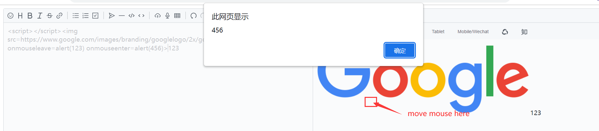

# 	Cross-site Scripting (XSS) - Stored in vanessa219/vditor

### Exploit Title: 

Cross-site Scripting (XSS) - Stored in GitHub repository vanessa219/vditor.

### Version:

vanessa219/vditor prior to version 3.8.15.

### Software Link:

https://github.com/Vanessa219/vditor

### Offical Demo Link:

https://b3log.org/vditor/demo/option-mode.html

### Analysis Report:

##### **environment：**

I tested the application of vditor with its cdn:  https://cdn.jsdelivr.net/npm/vditor ,the version of this cdn is 3.8.15.

Here is a sipmle Demo:

```html
<!DOCTYPE html>
<html lang="en">
<head>
    <meta charset="UTF-8">
    <meta http-equiv="X-UA-Compatible" content="IE=edge">
    <meta name="viewport" content="width=device-width, initial-scale=1.0">
    <title>XSS Demon</title>
    <link rel="stylesheet" href="https://cdn.jsdelivr.net/npm/vditor/dist/index.css">
    <script src="https://cdn.jsdelivr.net/npm/vditor"></script>
</head>
<body style="background-color: #fff;">
    <textarea id="desc" style="display: none;">
        123
    </textarea>
    <div id="edit"></div>
    <script>
        var edit = new Vditor('edit', {
            cache: {
                enable: false
            },
            value: document.getElementById('desc').value,
            width: '100%',
            height: window.innerHeight,
            preview: {
                markdown: {
                    sanitize: true //default security mode
                }
            }
        });
    </script>
</body>
</html>
```

##### **analyse：**

First, I made sure that the user's input would be processed by the application and rendered on the page.

After performing black-box testing, I found that if I used some special tags in the editor, tags that could cause the script to execute would be parsed afterwards.

Here are some special tags:

```
<form >
<object></object>
<script></script>
<input autofocus>\n
<scr<sc (end with a whitespace)
```

Now I can use dangerous tags like img, iframe, etc.

But I found that many tag attributes are disabled by the application, such as onerror, onload, etc.

Then I started another fuzzing, looking for a tag that could execute javascript code.

Eventually I found that the frame tag and its src attribute could execute javacript code, and my poc looked like this

```
<script></script>
```

onmouseleave and onmouseenter are the two main public properties of the dom tag, it can be used to trigger events, if the mouse moves to the picture will trigger the onmouseenter event, leave the picture will trigger the onmouseleave event, these events can execute arbitrary JavaScript code, but the application does not filter these two properties, which leads to the attacker can construct a normal large size image, as long as the victim mouse over the image or move out of the image will immediately trigger the event to achieve arbitrary javascript code execution.

This is stored xss and has a very high probability of triggering.



The offical demo can also be triggered. 

Some other tags such as img, p can also to use the same method to trigger the xss.

 

It also can add any styles to disguise such as size, color, etc.

### Repair Solutions:

Remove vulnerable characters from DOM elements or disable inline frames.